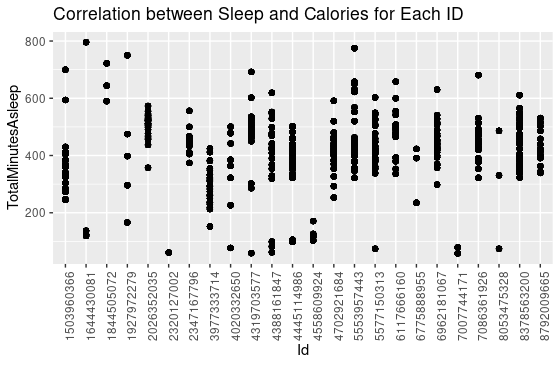
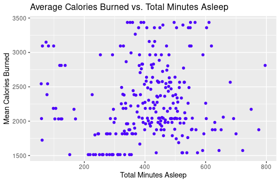
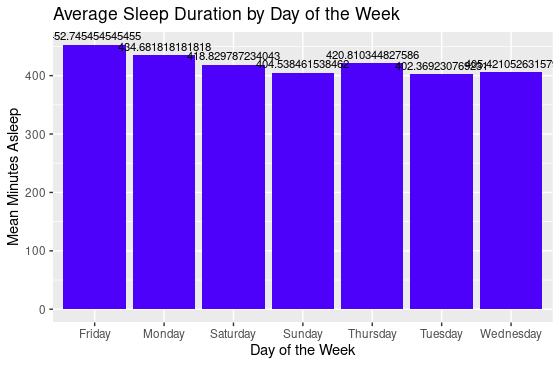
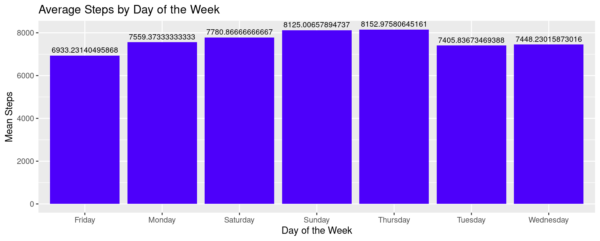

# BellaBeatCase
# Prepare:

- Obtained the data set from [Kaggle](insert_kaggle_link_here)
- Determined credibility of data by examining total downloads, tags, and doing personal analysis
- Some files too large for Excel
- Got familiar with all data by opening each CSV and checking out data
- Some data wide, some data long
- Verified Data to have 33 user IDs by counting distinct IDs
  - Used SUM(1/CountIF(Range, Range)
- Examined Weight log data
  - Only 8 users logged weight
    - 61% was self-reported, meaning there could be bias if individuals lied for whatever reason.
    - Has blank cells in fat data
- Ensured no blank cells (all good minus weight info)

# Process:

- Decided what data I wanted to use
  - I will look at Daily data first to gain some overall insights into usage and use more intensive data later if needed
  - Duplicated the data and put it all together in a new worksheet to use easily and preserve the original
  - Started with Daily Activity
    - Looked for unreliable people (lots of 0’s, otherwise known as missed days)
    - Defined unreliable as missed more than 25% of days
      - So, nobody
- Uploaded everything to R in a new file to house all analysis
- Correlation between sleep and calories burned is very low (0.022).
- Average total steps per day are 7638, which is a little bit less for having health benefits according to CDC research. They found that taking 8,000 steps per day was associated with a 51% lower risk for all-cause mortality (or death from all causes). Taking 12,000 steps per day was associated with a 65% lower risk compared with taking 4,000 steps.
- Go for a walk campaign.

# About the company:

Bellabeat is a high-tech company founded in 2013, specializing in health-focused smart products for women. With a global presence and a strong online presence through e-commerce channels and online retailers, Bellabeat's mission is to use technology to empower women with valuable insights into their health and wellness. The company offers a range of smart wellness products, including the Bellabeat app, the Leaf wellness tracker, the Time wellness watch, and the Spring water bottle, all designed to help women make informed decisions about their well-being.

# Business task:

Analyzing smart device usage data to gain insights into how consumers are using non-Bellabeat smart devices. These insights will be used to inform Bellabeat's marketing strategy.

# Goal:

Understand consumer behavior and identify opportunities for growth in the smart device market.

# Key stakeholders:

- Urška Sršen (Cofounder and Chief Creative Officer of Bellabeat)
- Sando Mur (Cofounder and key member of Bellabeat's executive team)
- The Bellabeat marketing analytics team
- The Bellabeat executive team
- Myself (the junior data analyst)
- Potential consumers of Bellabeat's products
- Marketing and advertising partners

# Process:

**Data sources used**:

FitBit Fitness Tracker Data on Kaggle in 18 CSV files. This dataset was generated by respondents to a distributed survey via Amazon Mechanical Turk between 03.12.2016 and 05.12.2016. Thirty eligible Fitbit users consented to the submission of personal tracker data, including minute-level output for physical activity, heart rate, and sleep monitoring. Individual reports can be parsed by export session ID (column A) or timestamp (column B). Variation between output represents the use of different types of Fitbit trackers and individual tracking behaviors/preferences.

**Limitations**:

1. The dataset comprises a limited sample size, with only 30 individuals included.
2. The data is approximately six years old, and Fitbit devices may have advanced to provide more precise results during that time.
3. Due to the data collection method being a survey, there is a potential for response bias, which may result in less accurate information as participants may not always provide entirely honest or precise responses.
4. When it comes to weight-related data, there are records from just eight users. Additionally, one of the fields contains numerous blank entries, and approximately two-thirds of the weight entries were manually input.

**Cleaning/Processing and Analyzing**:

**Data analyzed**:
- dailyActivity_merged.csv
- sleepDay_merged.csv
- weightLogInfo_merged.csv

**Applications used**:
EXCEL and R
I used Excel for the initial look at this data, utilizing pivot tables and Excel functions like AVERAGE, MIN, MAX. I then did some cleaning and verification of the data. 
I used R to do more in depth analysis of the data and create some visualizations

**EXCEL**
**Cleaning and Verifying**
I verified the start and end dates were consistent. I also noticed there were 33 IDs created, which implies there were some duplicate IDs created by a couple of users entering their info.

Next, I examined the Weight log data and noticed a few inconsistencies.
- Only 8 users logged weight
- 61% was self-reported, meaning there could be bias if individuals lied for whatever reason.
- I then looked for blank cells utilizing the =COUNTBLANK(Range) function.
  - There were blank cells in the fat data column.
    - Because of this, I will not include the fat data.

**Exploring and Analyzing**
First was summaring some of the Data from the dailyActivity_merged table where I found the average, min and max of each coloumn
|                        | TotalSteps | TotalDistance | TrackerDistance | LoggedActivitiesDistance | VeryActiveDistance | ModeratelyActiveDistance |
|------------------------|------------|---------------|-----------------|---------------------------|--------------------|--------------------------|
| Average                | 8319.7     | 6.0           | 6.0             | 3.1                       | 2.7                | 1.0                      |
| Min                    | 4.0        | 0.0           | 0.0             | 2.0                       | 0.0                | 0.0                      |
| Max                    | 36019.0    | 28.0          | 28.0            | 5.0                       | 21.9               | 6.5                      |

|                         | LightActiveDistance | SedentaryActiveDistance | VeryActiveMinutes | FairlyActiveMinutes | LightlyActiveMinutes | SedentaryMinutes | Calories |
|-------------------------|----------------------|-------------------------|-------------------|----------------------|-----------------------|------------------|----------|
| Average                 | 3.7                  | 0.0                            | 37.5                    | 23.0                       | 211.8                       | 992.5                  | 2314.0   |
| Min                        | 0.0                  | 0.0                            | 1.0                      | 1.0                         | 1.0                           | 2.0                     | 52.0       |
| Max                       | 10.7                  | 0.1                            | 210.0                  | 143.0                     | 518.0                       | 1440.0                 | 4900.0   |

To examine the integrity of the weight recording, I looked at the ‘IsManualReport’ column and used =1-COUNTIF(G2:G68, "false")/COUNTA(G2:G68) to see what percentage of the data was self-reported vs. being logged through one of the connected scale devices (TRUE).

I wanted to see what features people were using the least. To do so, I counted the non-null or ‘0’ entries for each column of the dailyActivity_merged table.
- First, I used =COUNTIF(Range, "<>0") to count the non-zero entries
- Next, I used =MIN(Range) function to identify the lowest utilized feature, which I determined to be ‘LoggedActivitiesDistance’ with only 32 entries.

The LoggedActivitiesDistance column represents the total kilometers from logged devices. Because only 32 entries were made for tracking distance (3% of total entries), this could indicate that users don’t always use the devices for distance training. Rather, it may be mainly used for other ‘non-distance’ related workouts/activities.

I then did some basic analysis of the sleepDay_merged table, utilizing the AVERAGE, MIN, and MAX functions.
|                 | Minutes Asleep | Time in Bed | Hours Asleep | Hours in Bed |
|-----------------|----------------|-------------|--------------|-------------|
| Average         | 419.4673123    | 458.6392252 | 7.0          | 7.6         |
| Min             | 58             | 61          | 1.0          | 1.0         |
| Max             | 796            | 961         | 13.3         | 16.0        |


I used COUNT() to identify how many entries were made on the sleep table to examine the utilization of the sleep tracking feature. I noticed people used the sleep tracking function quite regularly, as about 46% of the possible entries for sleep data were used.
- (30 days * 30 users) / COUNT(range)
- 900 / 413 sleep entries = 0.46 or 46%

Last, in Excel, I wanted to examine the relationship between Very Active Minutes and Average Calories burned by the users. To do so, I created a pivot table from the dailyActivity_merged table. I then used VeryActiveMinutes as my rows and Average of Calories burned for my values. I grouped my VeryActiveMinutes data in increments of 10 to identify if there were any patterns or thresholds for where calories burned substantially increased per active minute.

My findings, however, were as expected: More Very active minutes means more calories. Makes sense! Based on our user's data to meet the daily 2500 calorie burn rate, which is recommended by the CDC for users in the weight class of 72 kg, you should do a little more than 50 min of exercise. Users below the threshold of 50 minutes did not burn an average of 2500 calories a day. See table below for breakdown:
**Table 2**
| Very Active Minutes | Average of Calories |
| ------------------- | ------------------- |
| 0-9                | 2028.75             |
| 10-19              | 2432.968421         |
| 20-29              | 2232.071429         |
| 30-39              | 2389.196429         |
| 40-49              | 2224.044444         |
| 50-59              | 2649.257143         |
| 60-69              | 2997.138889         |
| 70-79              | 3156.875            |
| 80-89              | 3364.75             |
| 90-99              | 3426.428571         |
| 100-109            | 3620.3              |
| 110-119            | 3766.923077         |
| 120-129            | 3840.75             |
| 130-139            | 3823                |
| 180-189            | 3482                |
| 190-199            | 4546                |
| 200-210            | 4481.666667         |
| Grand Total        | 2303.609574         |

They could use these numbers to help people set goals for calorie burn rates. If you do x minutes, you should burn Y.

# R:

I then went into R to continue my analysis of this dataset and see if I could find some more actionable insights.

# Set up the working directory and load libraries
```markdown
```R
# Create a new folder to house all my stuff
dir.create("BellaBeat")
# Set up BellaBeat as the working directory
setwd("BellaBeat")

# Load libraries
library(tidyverse)
library(dplyr)
```
# Import and Structure Data
```R
# Create variables to make analyzing files easier
activity <- read_csv("dailyActivity_merged.csv")
calories <- read_csv("dailyCalories_merged.csv")
sleep <- read_csv("sleepDay_merged.csv")
weight <- read_csv("weightLogInfo_merged.csv")

# Check out the data structures
head(activity)
head(calories)
head(sleep)
head(weight)

# Change data types and rename columns
activity <- activity %>%
  mutate_at(vars(Id), as.character) %>%
  mutate_at(vars(ActivityDate), as.Date, format = "%m/%d/%y") %>%
  rename("Day" = "ActivityDate")

sleep <- sleep %>%
  mutate_at(vars(Id), as.character) %>%
  mutate_at(vars(SleepDay), as.Date, format = "%m/%d/%y") %>%
  rename("Day" = "SleepDay")

weight <- weight %>%
  mutate_at(vars(Id, LogId), as.character) %>%
  mutate_at(vars(Date), as.Date, format = "%m/%d/%y") %>%
  rename("Day" = "Date")

# Summarize data
summary(activity)
summary(weight)

# Create a new variable for summarization, excluding the Day column
summary_subset <- activity %>%
  select(-Day)
summary(summary_subset)
```
# Data Analysis
```R
# Join the data on Id, for activity and sleep to see if there is correlations
merged_data <- inner_join(activity, sleep, by = "Id")
# Calculate the correlation between TotalMinutesAsleep and Calories
correlation <- cor(merged_data$TotalMinutesAsleep, merged_data$Calories)

# Print the correlation coefficient
cat("Correlation between TotalMinutesAsleep and Calories:", correlation)

# Load the ggplot2 library if not already loaded
library(ggplot2)

# Create a scatterplot to demonstrate correlation
ggplot(data = merged_data, aes(x = TotalMinutesAsleep, y = Calories)) +
  geom_point() +
  labs(x = "Total Minutes Asleep", y = "Calories Burned") +
  ggtitle("Scatterplot of Total Minutes Asleep vs. Calories Burned")

# Create a scatterplot for each ID
correlation_data <- merged_data %>%
  group_by(Id) %>%
  summarize(Correlation = ifelse(sd(TotalMinutesAsleep) == 0 | sd(Calories) == 0, 0, cor(TotalMinutesAsleep, Calories)))

# Create a scatterplot of the correlations between Minutes asleep and Calories burned by each ID
ggplot(data = merged_data, aes(x = Id, y = TotalMinutesAsleep)) +
  geom_point() +
  labs(aes(x = "ID", y = "Correlation (Sleep vs. Calories)", color = Id)) +
  ggtitle("Correlation between Sleep and Calories for Each ID")

# Create a scatterplot of TotalMinutesAsleep vs. Calories
# Smooth data for better readability
ggplot(data = merged_data, aes(x = TotalMinutesAsleep, y = Calories)) +
  geom_point() +
  labs(x = "Total Minutes Asleep", y = "Calories Burned") +
  ggtitle("Scatterplot of Total Minutes Asleep vs. Calories Burned") +
  geom_smooth(method = "loess", se = FALSE)

# Plot the mean calories burned per sleep time
aggregated_data <- merged_data %>%
  group_by(TotalMinutesAsleep)
  
aggregated_data <- aggregated_data %>%
  summarize(MeanCalories = mean(Calories))

ggplot(data = aggregated_data, aes(x = TotalMinutesAsleep, y = MeanCalories)) +
  geom_point(color = '#4d00fa') +
  labs(x = "Total Minutes Asleep", y = "Mean Calories Burned") +
  ggtitle("Average Calories Burned vs. Total Minutes Asleep")

# Create a new column "DayOfWeek" in the "activity" dataframe by formatting the "Day" column
activity <- activity %>%
  mutate(DayOfWeek = format(Day, "%A"))

# Summarize the mean steps for each day of the week
steps_summary  <- activity %>%
  group_by(DayOfWeek) %>%
  summarise(MeanSteps = mean(TotalSteps))

# Create a bar graph to visualize the average steps by day of the week
ggplot(data = steps_summary, aes(x = DayOfWeek, y = MeanSteps)) +
  geom_bar(stat = "identity", fill = '#4d00fa') +
  labs(x = "Day of the Week", y = "Mean Steps") +
  ggtitle("Average Steps by Day of the Week") + 
  geom_text(aes(label = MeanSteps), vjust = -0.5, color = "black", size = 3)

```
# Share

The LoggedActivitiesDistance column represents total kilometers from logged devices. Because Only 32 entries were made for tracking distance (3% of total entries). This could indicate that users don’t always use the devices for distance training. Rather it may be mainly its used for other ‘non distance’ related workouts/activities.

If you refer to table 2 we can see the calories burned at different thresholds of activity levels.
BellaBeat could use these numbers to help people set goals for calorie burn rates. If you do x minutes you should burn Y calories “get up and move” or “10 more minutes and you will hit your goal”

Correlation between TotalMinutesAsleep and Calories: 0.02253083. this was surprisingly low. I assumed those who got better sleep may be more active during the day and burn more calories. 

Examining the correlation between these two variables further we can see the correlation for each ID represented on this plot. 



Next analyzing the calories burned With the exception of a few unusual cases, individuals who slept for durations ranging from 5 to 7 hours appeared to burn calories most consistently as the plot demonstrates a large grouping in the middle. However with such a low correlation we cant determine that one directly affects the other. However we can hypothesize that encouraging consistent sleep for 5-7 hours may help keep calorie burn rates consistent as well.


 

Now examining the average sleep duration in minutes for each day of the week we can notice that Sundays seem to be the lowest with Fridays being the highest. This could be used by the marketing team to send out sleep reminders on Sundays to prepare individuals for the week ahead. 


 
Lastly I examined the average steps by day of the week. Users tend to be most active with their steps on Sundays and Thursdays with Thursdays being the highest at 8152.97 per day. However from this data we can conclude that the average user even on their best day is not meeting the average step count recommended for weight loss by the CDC which is 10000 steps. To achieve significant weight loss through walking, you may need to set higher step count goals, such as 12,000 to 15,000 steps per day or more (womens health). 
 

